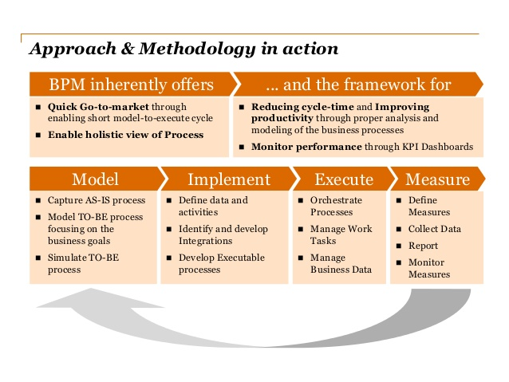

# camunda-playground
bpm for programmers?

## Camunda

Camunda BPM is good example of BPMN based workflow automation toolset (or process automation suite, whatever). There's other toolsets also, especially single vendor driven offerings, but Camunda seems to be more than just ok for my needs.

Camunda BPM can be used as standalone installation or embedded within host applications. When used as embedded workflow engine Camunda BPM offers native Java API's.

Camunda BPM was forked 2013 from open source library Activiti https://www.activiti.org/. Activiti is commercially available as part of Alfresco suite https://www.alfresco.com/platform/process-services-bpm. 

Camunda BPM is offered as Open Source (Apache 2.0 lisence), commercial version adds monitoring and optimization features https://camunda.com/enterprise/. Camunda can be seen as "best of breed" open source stack.

Camunda as company has recently (12/2018) raised 25 million euros of venture capital https://blog.camunda.com/post/2018/12/camunda-raises-series-a/. They are growing, just as last year https://blog.camunda.com/post/2017/12/camunda-year-in-review/.

Camunda develops also new lightweight Workflow engine for microservices https://zeebe.io/

From my standpoint it look like Camunda as company and Camunda BPM have some strong points

- Rooted on experiences from consuling service, codebase already tested
- Current offer fullfills standards of OMG namely BPMN, DMN & CMMN
- Event based microservices use cases are covered by Camunda BPM (mature) and soon performance optimized witb Zeebe (bleeding edge)

## BPM features

Motivation of using Process Automation lies on search for excellency in long run - making algorithms of company easy to reason and
fast to change - or easier programming model - to prevent hidden monolith, i.e. temporary and physically coupled systems which need
to be deployed and operated as whole.

Bpm toolset provides typically
- modeling tools
- tasklist for user facing actions (manual action: yes/no questions, data entry, etc.)
- toolkits for custom application (libraries for building clients, querying states of processes, errors, etc.)
- analytics and problem solving tools (can be called cockpit or dashboard or whatever, shows state of single process or overall
system)
- admin tools (reports, usage rights, etc.)
- engine for running processes (routing, transforming, calling endpoints, starting compensation, returning values, ..)
- rule engine (executing rules, simulating rule changes on used data, etc.)
- repository storing process state
- often highest value of bpm suites offer comes from production ready adapters for protocols (hl7, hipaa, .. etc) and systems (sap,
siebel, salesforce, ..)

Most sophisticated tools are using standard based process notation (BPMN) plus rule (DMN) and case (CMMN) descriptions. 

https://www.slideshare.net/camunda/camundacon-2018-the-reemergence-of-workflow-automation-keynote-camunda

## BPM enables continuous improvement

It is seldom that systems doesn't change, and thus it's valuable to build them easily adaptable.

There's theory: making process easy to understand and change makes it possible to measure and improve.

https://www.slideshare.net/camunda/case-study-camunda-bpm-in-pwc-project

This might seem business jargon, not only because it comes from PWC, but as collaboration is hard it's really valuable if IT and
business units can use same model as single truth.

# BPM single vendor suite or best of breed?

There is clear distinction of BPM use cases to
- centrally managed, monolithic, process and information hubs for enterprises
- application or solution level workflow and process integration for routing and transformation 

Monolithic single vendor suites were traditionally thought as standardisation and cost saving tools. So: here we aim for efficiency.

Application and solution level point solutions can be called as api gateways, bpm tools, eai tools, enterprise service bus, etc. and they are most propably provided as part of IT operations or software development, and could aimed to modernise enterprise.

Beware to use single vendor suite targeted for complex enterprise intergration task to "simple" solution embedded application integration use cases. Opposite is definitely also true: if you need lot of out of box connectors for ERM, CRM or .. solutions then low level engine alone might not really solve challenge you have.

Example: Users of Oracle SOA suite are on "in single vendor we believe" category. Don't try it without good reason. 

Example 2: Camunda BPM users are on "clean fast forward engine is all we need" category. It tries to do on thing well. Just try it.

# BPM use cases

Process orchestration use case can be most common motivation to invest in BPM engine.
Using BPM and BPMN / DMN promotes collaboration and visibility, and opens up possibilities to develop processes in whole company
level (no silos here).

Still, there is not single use case for BPM, but several of them
- https://blog.bernd-ruecker.com/5-workflow-automation-use-cases-you-might-not-have-thought-of-9bdeb0e71996

Microservices that have database per service are good candidates for external workflow control when data needs to be consistent

Saga is pattern which can be implemented using BPM
- https://microservices.io/patterns/data/saga.html

These technical use cases are making eventually consistent data processing using distributed transactions and microservices reality.
- https://blog.bernd-ruecker.com/saga-how-to-implement-complex-business-transactions-without-two-phase-commit-e00aa41a1b1b
