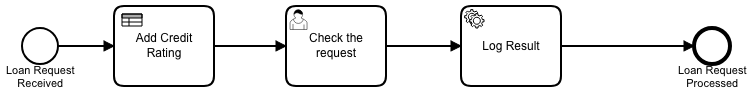
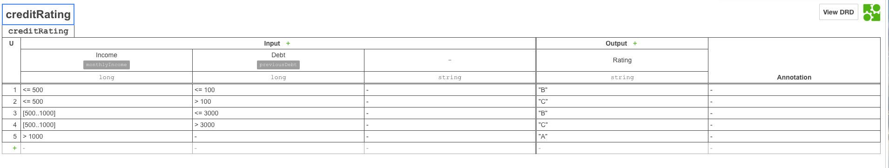

# camunda BPM - Getting Started with camunda BPM and Spring Boot

## seed

This project was generated by spring boot initializer https://start.spring.io/

Base settings
- Kotlin, Gradle

Features selected
- Web, H2, Liquibase, JOOQ, Jersey (JAX-RS), Feign

Code and definitions for Camunda BPM were taken from https://docs.camunda.org/get-started/spring-boot/

## changes

Notable changes

- Generated LoanApprovalApplication.tk annotatated to define it as process application
- LoanApprovalApplication.tk exteded to start one process right after deployment of app
- LoanController.tk added to support get request to /requestLoan
- LoanRequest.tk added to serialize result of process initialization (returns id)
- creditRating.dmn added to resolve credit rating
- LogVariables java delegate added to LoanDelegates.kt
- loanApproval.bpmn exteded with execution of rule and logging of variables
- Changed admin user to demo/demo in resources/application.yaml

## tools

you should install these

- idea
- camunda designer

## process

Process is extended with Add Credit Rating rule task, which uses decision table to resolve credit rating (a, b, c)

After manual task java delegate is used to write process variables to log

## rule

This is very simple decision table, which is just interested in income and existing loans and is deriving from these credit rating.

## see process and rule

there's just one process and one rule and you can look inside them
- get camunda modeler https://camunda.com/products/modeler/
- install it
- open resources/loanApproval.bpmn or resources/creditRating.dmn

It's not very fancy, but enough for now

## run and test

just run LoanApprovalApplication.tk in Idea

See logs to find out if engine is deployed and see it running at localhost:8080 with demo/demo

Try also to send requests to  localhost:8080/requestLoan, result should be something like id: "6be0e2e5-1140-11e9-95f7-9cb6d0f48aa2"

if you really want to follow how variables are used you should give them as get parameters
- ex. localhost:8080/requestLoan?income=1000&loan=100 (debts defaults to zero)
- ex. localhost:8080/requestLoan?income=1000&debts=123&loan=100

impotant to look for:
- there should be 1 process definition deployed, and at the very start one process instance started (one human task waiting)
- there should be one process instance, i.e. one human task waiting, for each get request to /requestLoan
